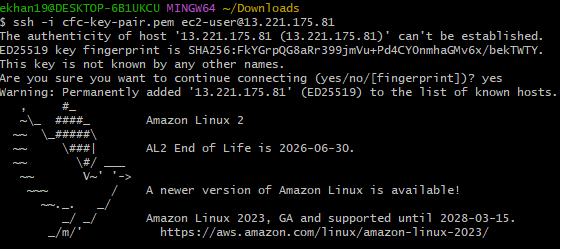

---

```markdown
# VPC + Bastion + Private ASG + (Internal) ALB — Terraform PoC

> **Goal:** One VPC (`10.1.0.0/16`) with three subnets spread across two AZs, a public Bastion host, a private Application tier running Apache in an Auto Scaling Group (ASG), and an ALB that sends web traffic to the ASG. 
 
> **Note:** If your account currently lacks ELB/ALB permissions, see **[Test Without ALB](#test-without-alb)**.


---

## Architecture

- **VPC:** `10.1.0.0/16`
- **Subnets (all /24):**
  - **Management** (public): `10.1.78.0/24` in `us-east-1b` — **internet-accessible**
  - **Application** (private): `10.1.9.0/24` in `us-east-1b` — **no internet ingress**
  - **Backend** (private): `10.1.21.0/24` in `us-east-1a` — **no internet ingress**
- **IGW** for public subnet; **NAT** in public subnet for private outbound (e.g., package installs)
- **Bastion EC2** (`t2.micro`) in Management subnet; SSH (22) allowed **only** from your `/32`
- **App tier**: Launch Template + **ASG** (min=2, max=6, `t2.micro`), Apache installed via user data, runs in **Application subnet**
- **ALB (internal)** across private subnets; HTTP(80) from Bastion SG → ALB, ALB → App SG

### Diagram & Screenshots

- **Diagram:**  
  

- **Screenshots:**  
  - Bastion instance:   
  - Subnets/Routes:   
  - ALB Error / Service Limitation: 

> Rename the files as needed; update the paths above.

---

## Repository Layout

```

CTF-CHALLENGE/
├─ main.tf
├─ provider.tf
├─ backend.tf
├─ variables.tf
├─ outputs.tf
├─ modules/
│  ├─ vpc/
│  │  
│  ├─ network/   # subnets, IGW, NAT, routes
│  │  
│  ├─ security/  # SGs for bastion, app, alb
│  │  
│  ├─ bastion/   # single EC2 in public subnet
│  │  
│  └─ alb/       # internal ALB + TG + listener
│  │  
│  └─ app/       # AMI + ASG + launch_template  for ec2's
└─ README.md/
    # docs + diagram & screenshots captured

````

---

## Requirements

- Terraform **~> 1.6**
- AWS Provider **~> 5.x**
- AWS CLI configured (`aws sts get-caller-identity` works)
- **Existing EC2 Key Pair** in the region (name only)
- Your **public IP (/32)** for bastion SSH allowlist

---

## Variables (high level)

Defined in `variables.tf` (root):

- `aws_region` (default: `us-east-1`)
- `vpc_cidr` (default: `10.1.0.0/16`)
- `project`, `environment` (used for naming/tags)
- `subnets` map (pre-filled with your 3 subnets + AZs + public/private flags)
- `bastion_allowed_ssh_cidr` (e.g., `203.0.113.45/32`)
- `bastion_key_name` (your existing key pair name)

---

## Deploy

```bash
# From the repo root
terraform init

# Plan with your values
terraform plan \
  -var 'aws_region=us-east-1' \
  -var 'vpc_cidr=10.1.0.0/16' \
  -var 'project=cpmc' \
  -var 'environment=dev' \
  -var 'bastion_allowed_ssh_cidr=YOUR.IP.ADDR/32' \
  -var 'bastion_key_name=YOUR_KEYPAIR_NAME'

# Apply
terraform apply -auto-approve \
  -var 'aws_region=us-east-1' \
  -var 'vpc_cidr=10.1.0.0/16' \
  -var 'project=cpmc' \
  -var 'environment=dev' \
  -var 'bastion_allowed_ssh_cidr=YOUR.IP.ADDR/32' \
  -var 'bastion_key_name=YOUR_KEYPAIR_NAME'
````

**Outputs you’ll see** (examples):

* `bastion_public_ip`, `bastion_private_ip`
* `alb_dns_name` *(internal)*
* `subnet_ids` (by name), route table IDs
* `vpc_id`, `vpc_cidr_block`, `vpc_arn`

---

## Security Groups (flow)

* **Bastion SG**

  * Ingress: `22/tcp` from **your /32** only
  * Egress: all (for updates/tools)
* **ALB SG**

  * Ingress: `80/tcp` from **Bastion SG** (internal testing)
  * Egress: all
* **App SG**

  * Ingress:

    * `22/tcp` **from Bastion SG only** (admin)
    * `80/tcp` **from ALB SG only** (web)
  * Egress: all (out via NAT)

This design keeps the app private; web hits go **Bastion → ALB → ASG instances**.

---

## Test With ALB (when enabled)

**From your laptop:**

```bash
ssh -i /path/to/key.pem ec2-user@$(terraform output -raw bastion_public_ip)
```

**From the bastion:**

```bash
# Resolve & hit the internal ALB
nslookup $(terraform output -raw alb_dns_name)
curl -s http://$(terraform output -raw alb_dns_name)
```

**Or port-forward from your laptop to browse locally:**

```bash
ssh -i /path/to/key.pem -L 8080:$(terraform output -raw alb_dns_name):80 ec2-user@$(terraform output -raw bastion_public_ip)
# Then open http://localhost:8080
```

You should see the Apache page rendered by user-data:

```
<h1>CPMC App - <instance-hostname></h1>
```

---

## Test Without ALB

If your account lacks access to create  ELB/ALB right now, you still can verify Apache on the app instances.

### Option A — Temporary Terraform rule (preferred; revert after)

1. In `modules/security/variables.tf`, add:

```hcl
variable "enable_temp_http_from_bastion" {
  description = "TEMP: allow HTTP 80 from bastion directly to app instances for testing without ALB"
  type        = bool
  default     = false
}
```

2. In `modules/security/main.tf`, add below existing rules:

```hcl
# TEMP TEST RULE: Allow HTTP 80 from bastion directly to app (bypassing ALB)
resource "aws_security_group_rule" "app_http_from_bastion_temp" {
  count                   = var.enable_temp_http_from_bastion ? 1 : 0
  type                    = "ingress"
  description             = "TEMP: HTTP 80 from bastion (no ALB available)"
  from_port               = 80
  to_port                 = 80
  protocol                = "tcp"
  source_security_group_id= aws_security_group.bastion.id
  security_group_id       = aws_security_group.app.id
}
```

3. Re-run with the toggle on:

```bash
terraform apply -auto-approve -var 'enable_temp_http_from_bastion=true' \
  -var 'aws_region=us-east-1' -var 'vpc_cidr=10.1.0.0/16' \
  -var 'project=cpmc' -var 'environment=dev' \
  -var 'bastion_allowed_ssh_cidr=YOUR.IP/32' \
  -var 'bastion_key_name=YOUR_KEYPAIR_NAME'
```

4. From the **bastion**, curl the **private IP** of an app instance (discover via EC2 console or `aws ec2 describe-instances` if you prefer):

```bash
curl -s http://<APP_INSTANCE_PRIVATE_IP>
```

> **Important:** After you confirm Apache works, **set `enable_temp_http_from_bastion=false` and apply** to remove the temporary rule.

### Option B — Manual (quick & dirty; creates drift)

* Add an inbound rule on the **App SG**: HTTP(80) from **Bastion SG**.
* Test from bastion (`curl http://<app-private-ip>`).
* **Remove the rule** afterwards.

---

## Switching to Internet-Facing ALB (optional)

AWS requires **≥ 2 public subnets in different AZs** for an internet-facing ALB.

Steps (high level):

1. Add a **second public subnet** in `us-east-1a` to the `subnets` map (`public = true`), associate it to the **public route table** (IGW route).
2. In the **ALB module**, set `internal = false` and pass the **two public subnet IDs**.
3. In **ALB SG**, allow `80/443` from your IP (or `0.0.0.0/0` if you truly want public).
4. (Optional) Add ACM cert + HTTPS listener (443) and redirect 80→443.

---

## Troubleshooting

* **“ELB/ALB not available / access denied / service disabled”:**
  Your AWS account or region may not have ELBv2 enabled or allowed. Contact AWS Support to enable **Elastic Load Balancing v2** or verify your **Service Control Policies** and **permissions**. In the meantime, use **[Test Without ALB](#test-without-alb)**.

* **Private instances can’t `yum install`/update:**
  Ensure the **NAT Gateway** is up in the public subnet and private route table has default route `0.0.0.0/0 → nat-gateway`.

* **SSH to bastion fails:**

  * Confirm `bastion_allowed_ssh_cidr` matches your current IP (`curl -4 ifconfig.me`).
  * Ensure your **key pair** name exists in the region and you use the correct `.pem`.

* **ALB health checks fail (when enabled):**

  * App SG must allow HTTP(80) **from ALB SG**.
  * Apache must be running (see user-data and `/var/log/cloud-init*`).

---

## Cleanup

```bash
terraform destroy -auto-approve \
  -var 'aws_region=us-east-1' \
  -var 'vpc_cidr=10.1.0.0/16' \
  -var 'project=cpmc' \
  -var 'environment=dev' \
  -var 'bastion_allowed_ssh_cidr=YOUR.IP/32' \
  -var 'bastion_key_name=YOUR_KEYPAIR_NAME'
```

> Destroy order is handled by Terraform. NAT/EIP/ALB (when enabled) may take a minute to tear down.

---

## Cost Notes

* **NAT Gateway** and **ALB** incur hourly + data processing charges.
* **EC2** instances (bastion + ASG) billed per-hour.
* **EIP** is billed when allocated & **not** associated (or minimal when associated).

---

## Security Notes

* Public ingress limited to **SSH → Bastion** from your `/32`.
* App instances are **private**; only ALB (or temporary rule during tests) can reach HTTP(80).
* Everything else goes outbound through **NAT** (no inbound to private subnets from the internet).

---

## What This PoC Demonstrates

* Modular Terraform (VPC, Network, Security, Bastion, ALB, App)
* Private application tier behind a load balancer
* Least-privilege security group flows
* Repeatable tagging & naming patterns
* Clear upgrade path to a public ALB

---

